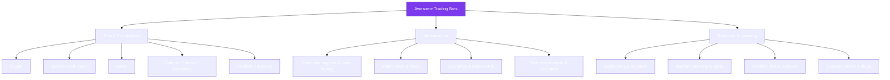

<p align="center">
  
</p>

<h1 align="center">Awesome Trading Bots <a href="https://github.com/sindresorhus/awesome"></a></h1>

<p align="center">
  <strong>The most complete, hand-curated list of open-source trading bots, frameworks, libraries, and learning resources — across crypto, stocks, forex, options, futures, and prediction markets.</strong>
</p>

<p align="center">
  Built and maintained by <a href="https://viprasol.com"><strong>Viprasol Tech</strong></a> — Fintech Experts. Full-Stack Builders.
</p>

<p align="center">
  <a href="https://github.com/Viprasol-Tech/awesome-trading-bots/actions/workflows/lint.yml"></a>
  <a href="LICENSE"></a>
  <a href="https://github.com/sindresorhus/awesome"></a>
  <a href="#contributing"></a>
  <a href="CODE_OF_CONDUCT.md"></a>
  <a href="https://t.me/viprasol_help"></a>
  <a href="https://github.com/Viprasol-Tech/awesome-trading-bots/stargazers"></a>
</p>

---

> ## Disclaimer
> Trading bots can lose money. Everything here is for **educational purposes only** and is **not financial advice**. Automated trading involves substantial risk, including the **total and rapid loss of capital**; leveraged and derivatives products can lose more than your deposit. Backtested or past performance does **not** predict future results, and live results routinely differ from simulations because of slippage, fees, latency, and market regime shifts. Always **paper-trade first**, start with capital you can afford to lose, read each project's own disclaimer and license, and comply with the laws, tax rules, and platform terms in your jurisdiction. Nothing here is an endorsement of any project, exchange, or strategy.

---

## Contents

- [What makes a good trading bot?](#what-makes-a-good-trading-bot)
- [The trading-bot landscape](#the-trading-bot-landscape)
- [Viprasol open-source bots](#viprasol-open-source-bots)
- [Crypto trading bots](#crypto-trading-bots)
- [Stock & multi-asset trading bots](#stock--multi-asset-trading-bots)
- [Forex trading bots](#forex-trading-bots)
- [Options, futures & derivatives](#options-futures--derivatives)
- [Prediction-market bots](#prediction-market-bots)
- [Backtesting & research frameworks](#backtesting--research-frameworks)
- [Execution engines & order routing](#execution-engines--order-routing)
- [Market data & feeds](#market-data--feeds)
- [Technical analysis & indicators](#technical-analysis--indicators)
- [Machine learning & alpha research](#machine-learning--alpha-research)
- [Portfolio, risk & analytics](#portfolio-risk--analytics)
- [Exchange & broker APIs](#exchange--broker-apis)
- [By programming language](#by-programming-language)
- [Bot framework comparison](#bot-framework-comparison)
- [Learning resources](#learning-resources)
- [Related awesome lists](#related-awesome-lists)
- [Contributing](#contributing)
- [Contact](#contact--viprasol-tech-private-limited)
- [License](#license)

## What makes a good trading bot?

Before you pick a framework, know what separates a toy from a production system. Use this as a checklist when evaluating any project on this list:

- **Backtesting that matches live** — same code path for simulation and live, realistic fills, fees, and slippage. Beware look-ahead bias and survivorship bias.
- **Risk management first** — position sizing, max drawdown limits, per-trade and per-day loss caps, and a working kill switch.
- **Reliable execution** — idempotent orders, reconnection logic, rate-limit handling, and reconciliation between bot state and exchange state.
- **Observability** — structured logs, metrics, and alerts (Telegram/Discord/email) so you know when something breaks at 3 a.m.
- **Secrets hygiene** — API keys with the *minimum* permissions (never enable withdrawals), IP allow-lists, and no keys in source control.
- **Active maintenance** — recent commits, responsive issues, and a real community. A stale bot against a live market is a liability.

## The trading-bot landscape



A typical bot wires these layers together: **data feed -> signal/strategy -> risk & sizing -> execution/router -> exchange/broker**, with **backtesting** running the exact same strategy code against historical data and **analytics** measuring the results.

## Viprasol open-source bots

Free, MIT-licensed, working bots built and maintained by [Viprasol Tech](https://viprasol.com). Each is a small, readable, fully-tested Python package — great for learning the mechanics of a domain:

- [kalshi-trading-bot](https://github.com/Viprasol-Tech/kalshi-trading-bot) — Framework for Kalshi prediction markets (RSA-PSS auth, strategy engine, backtester, risk manager).
- [ai-trading-bot](https://github.com/Viprasol-Tech/ai-trading-bot) — Broker-agnostic AI/ML signal-ensemble trading framework.
- [crypto-trading-bot](https://github.com/Viprasol-Tech/crypto-trading-bot) — Multi-exchange crypto bot with grid & DCA strategies.
- [ai-crypto-trading-bot](https://github.com/Viprasol-Tech/ai-crypto-trading-bot) — AI alpha engine: feature engineering, scoring, Kelly sizing.
- [solana-trading-bot](https://github.com/Viprasol-Tech/solana-trading-bot) — Solana DEX AMM math, slippage, and cross-pool arbitrage.
- [stock-trading-bot](https://github.com/Viprasol-Tech/stock-trading-bot) — Cross-sectional momentum ranking & portfolio rebalancing.
- [forex-trading-bot](https://github.com/Viprasol-Tech/forex-trading-bot) — Pip/lot math, risk-based position sizing, trend strategy.
- [options-trading-bot](https://github.com/Viprasol-Tech/options-trading-bot) — Black-Scholes pricing, Greeks, and strategy payoffs.
- [polymarket-trading-bot](https://github.com/Viprasol-Tech/polymarket-trading-bot) — Edge, YES/NO arbitrage, and Kelly sizing for binary markets.

## Crypto trading bots

- [Freqtrade](https://github.com/freqtrade/freqtrade) — Popular free crypto trading bot in Python with backtesting, hyperopt, ML, and Telegram control.
- [Hummingbot](https://github.com/hummingbot/hummingbot) — Open-source market-making and arbitrage bot for CEX and DEX venues.
- [Jesse](https://github.com/jesse-ai/jesse) — Advanced crypto trading framework focused on simplicity and accurate backtesting.
- [OctoBot](https://github.com/Drakkar-Software/OctoBot) — Modular crypto trading bot with a web UI and strategy marketplace.
- [Kelp](https://github.com/stellar/kelp) — Open-source trading and market-making bot (Stellar and others).
- [Gekko](https://github.com/askmike/gekko) — Beginner-friendly Bitcoin trading bot and backtester (archived, still instructive).
- [Zenbot](https://github.com/DeviaVir/zenbot) — Command-line crypto trading bot with high-frequency support and genetic backtesting.
- [Superalgos](https://github.com/Superalgos/Superalgos) — Visual, community-driven platform for designing and running crypto strategies.
- [crypto-trading-bot (Haehnchen)](https://github.com/Haehnchen/crypto-trading-bot) — Node.js bot for Bitmex, Bitfinex, and Binance with strategy support.
- [PyTrendFollow](https://github.com/chrism2671/PyTrendFollow) — Systematic trend-following for crypto and futures.

## Stock & multi-asset trading bots

- [QuantConnect LEAN](https://github.com/QuantConnect/Lean) — Open-source algorithmic trading engine for equities, futures, options, FX, and crypto.
- [Nautilus Trader](https://github.com/nautechsystems/nautilus_trader) — High-performance, event-driven trading platform in Python/Rust for backtest and live.
- [vn.py](https://github.com/vnpy/vnpy) — Full-featured Python quant trading platform popular in Asian markets.
- [OpenBB](https://github.com/OpenBB-finance/OpenBB) — Open-source investment-research platform (the open alternative to a Bloomberg Terminal).
- [Lumibot](https://github.com/Lumiwealth/lumibot) — Beginner-friendly Python framework for stocks, options, and crypto with broker integrations.
- [QSTrader](https://github.com/mhallsmoore/qstrader) — Modular event-driven backtesting and live-trading library for institutional-style strategies.
- [PyAlgoTrade](https://github.com/gbeced/pyalgotrade) — Event-driven algorithmic trading library with backtesting and paper trading.
- [eiten](https://github.com/tradytics/eiten) — Statistical and algorithmic portfolio construction (eigen, minimum-variance, genetic).

## Forex trading bots

- **Viprasol:** see [`forex-trading-bot`](#viprasol-open-source-bots) above — risk-based FX position sizing and a trend strategy.
- [MetaTrader MQL community](https://www.mql5.com/en/code) — Large library of open Expert Advisors (MQL4/MQL5) for MT4/MT5.
- [oanda-api-v20](https://github.com/hootnot/oanda-api-v20) — Python wrapper for the OANDA v20 REST API (FX and CFDs).
- [freqtrade-strategies](https://github.com/freqtrade/freqtrade-strategies) — Community strategy templates adaptable to FX-style mean reversion and trend.
- [tpqoa](https://github.com/yhilpisch/tpqoa) — Lightweight Python wrapper around OANDA's API for streaming and backtesting FX.

## Options, futures & derivatives

- **Viprasol:** see [`options-trading-bot`](#viprasol-open-source-bots) above — Black-Scholes pricing, Greeks, and payoffs.
- [QuantLib](https://github.com/lballabio/QuantLib) — Comprehensive quantitative-finance library for derivatives pricing and risk.
- [py_vollib](https://github.com/vollib/py_vollib) — Fast Black-Scholes-Merton option pricing and implied-volatility library.
- [optopsy](https://github.com/michaelchu/optopsy) — Backtesting library for options strategies on historical chains.
- [ib_insync](https://github.com/erdewit/ib_insync) — Pythonic Interactive Brokers API, widely used for options and futures automation.
- [tastytrade (Python)](https://github.com/tastyware/tastytrade) — Unofficial Python SDK for the tastytrade options brokerage.

## Prediction-market bots

- **Viprasol:** see [`kalshi-trading-bot`](#viprasol-open-source-bots) and [`polymarket-trading-bot`](#viprasol-open-source-bots) above.
- [Manifold Markets](https://github.com/manifoldmarkets/manifold) — Open-source play-money prediction-market platform with a public API.
- [py-clob-client](https://github.com/Polymarket/py-clob-client) — Official Python client for the Polymarket CLOB order book.
- [kalshi-starter-code-python](https://github.com/Kalshi/kalshi-starter-code-python) — Official Kalshi API starter code for Python.

## Backtesting & research frameworks

- [Backtrader](https://github.com/mementum/backtrader) — Popular, feature-rich Python backtesting framework.
- [vectorbt](https://github.com/polakowo/vectorbt) — Fast, vectorised backtesting and quantitative research at scale.
- [backtesting.py](https://github.com/kernc/backtesting.py) — Minimal, fast backtesting library with interactive plots.
- [Zipline (reloaded)](https://github.com/stefan-jansen/zipline-reloaded) — Maintained fork of the classic Pythonic algorithmic-trading library.
- [bt](https://github.com/pmorissette/bt) — Flexible backtesting for portfolio-based and allocation strategies.
- [fastquant](https://github.com/enzoampil/fastquant) — Backtest strategies in a few lines of code, wrapping Backtrader.

## Execution engines & order routing

- [Nautilus Trader](https://github.com/nautechsystems/nautilus_trader) — Production-grade event-driven engine with the same code for backtest and live.
- [Hummingbot Gateway](https://github.com/hummingbot/gateway) — Standardised gateway/router for DEX and protocol connectivity.
- [Roq Trading Solutions](https://github.com/roq-trading/roq-api) — Low-latency C++ market-connectivity and order-management API.
- [barter-rs](https://github.com/barter-rs/barter-rs) — Rust framework for building event-driven live and backtest trading engines.

## Market data & feeds

- [yfinance](https://github.com/ranaroussi/yfinance) — Download market data from Yahoo Finance.
- [Alpha Vantage](https://github.com/RomelTorres/alpha_vantage) — Python wrapper for the Alpha Vantage market-data API.
- [Tardis.dev](https://github.com/tardis-dev/tardis-python) — High-resolution historical crypto market data (tick, book, trades).
- [databento (Python)](https://github.com/databento/databento-python) — Normalised historical and live institutional market data.
- [findatapy](https://github.com/cuemacro/findatapy) — Unified interface to many market-data sources (Bloomberg, Quandl, ALFRED).

## Technical analysis & indicators

- [pandas-ta](https://github.com/twopirllc/pandas-ta) — 130+ technical-analysis indicators for pandas DataFrames.
- [TA-Lib (Python)](https://github.com/TA-Lib/ta-lib-python) — Python bindings for the classic TA-Lib indicator library.
- [ta](https://github.com/bukosabino/ta) — Pure-Python technical-analysis indicators built on pandas.
- [tulipindicators](https://github.com/TulipCharts/tulipindicators) — Fast C technical-analysis library with bindings.
- [finta](https://github.com/peerchemist/finta) — Common financial technical indicators implemented in pandas.

## Machine learning & alpha research

- [Qlib](https://github.com/microsoft/qlib) — Microsoft's AI-oriented quant investment platform (data, models, backtest).
- [FinRL](https://github.com/AI4Finance-Foundation/FinRL) — Deep reinforcement learning framework for automated trading.
- [tensortrade](https://github.com/tensortrade-org/tensortrade) — Reinforcement-learning framework for training trading agents.
- [mlfinlab](https://github.com/hudson-and-thames/mlfinlab) — Implementations of techniques from *Advances in Financial Machine Learning*.
- [alphalens (reloaded)](https://github.com/stefan-jansen/alphalens-reloaded) — Performance analysis of predictive (alpha) factors.

## Portfolio, risk & analytics

- [QuantStats](https://github.com/ranaroussi/quantstats) — Portfolio analytics, tear sheets, and risk metrics for quants.
- [PyPortfolioOpt](https://github.com/robertmartin8/PyPortfolioOpt) — Portfolio optimisation (mean-variance, Black-Litterman, HRP).
- [Riskfolio-Lib](https://github.com/dcajasn/Riskfolio-Lib) — Portfolio optimisation and quantitative strategic asset allocation.
- [pyfolio (reloaded)](https://github.com/stefan-jansen/pyfolio-reloaded) — Performance and risk analysis of financial portfolios.
- [empyrical (reloaded)](https://github.com/stefan-jansen/empyrical-reloaded) — Common financial risk and performance metrics.

## Exchange & broker APIs

- [CCXT](https://github.com/ccxt/ccxt) — Unified crypto exchange trading API for 100+ exchanges (Python/JS/PHP/C#).
- [python-binance](https://github.com/sammchardy/python-binance) — Popular unofficial Binance REST and WebSocket client.
- [alpaca-py](https://github.com/alpacahq/alpaca-py) — Official Python SDK for the commission-free Alpaca stock/crypto API.
- [ib_insync](https://github.com/erdewit/ib_insync) — Pythonic, async-friendly client for Interactive Brokers.
- [tda-api](https://github.com/alexgolec/tda-api) — Unofficial client for the TD Ameritrade / Schwab trading API.

## By programming language

| Language | Notable projects |
| --- | --- |
| **Python** | Freqtrade, Jesse, Backtrader, vectorbt, Nautilus Trader, Qlib, FinRL, CCXT, ib_insync |
| **JavaScript / TypeScript** | Gekko, Zenbot, crypto-trading-bot (Haehnchen), CCXT, Hummingbot Gateway |
| **C# / .NET** | QuantConnect LEAN, CCXT |
| **C++** | QuantLib, Roq Trading Solutions, tulipindicators |
| **Rust** | barter-rs, Nautilus Trader (core), CCXT (bindings in progress) |
| **MQL4 / MQL5** | MetaTrader MQL community Expert Advisors |

## Bot framework comparison

A quick orientation for the most popular general frameworks. Always verify current capabilities against each project's docs.

| Project | Language | Primary focus | Backtesting | Live trading | UI |
| --- | --- | --- | --- | --- | --- |
| [Freqtrade](https://github.com/freqtrade/freqtrade) | Python | Crypto strategies | Yes | Yes | Web + Telegram |
| [Jesse](https://github.com/jesse-ai/jesse) | Python | Crypto research | Yes | Yes | Web |
| [Hummingbot](https://github.com/hummingbot/hummingbot) | Python | Market making / arb | Limited | Yes | CLI |
| [Nautilus Trader](https://github.com/nautechsystems/nautilus_trader) | Python/Rust | Multi-asset, low-latency | Yes | Yes | Code-first |
| [QuantConnect LEAN](https://github.com/QuantConnect/Lean) | C#/Python | Multi-asset research | Yes | Yes | Cloud + local |
| [Backtrader](https://github.com/mementum/backtrader) | Python | Backtesting library | Yes | Partial | Code-first |

## Learning resources

- [Awesome Quant](https://github.com/wilsonfreitas/awesome-quant) — A broader curated list of quant-finance libraries and tools.
- [Machine Learning for Trading (Stefan Jansen)](https://github.com/stefan-jansen/machine-learning-for-trading) — Companion code for the popular ML-for-trading book.
- [Quantitative Economics with Python (QuantEcon)](https://github.com/QuantEcon/lecture-python-programming.notebooks) — Free lectures on economic modelling and computation.
- [Algorithmic trading basics](https://www.investopedia.com/terms/a/algorithmictrading.asp) — Introductory reading on algo trading.
- [Freqtrade docs](https://www.freqtrade.io/en/stable/) — One of the best-written practical guides to running a bot end to end.

## Related awesome lists

- [Awesome Quant](https://github.com/wilsonfreitas/awesome-quant) — Quant-finance libraries, data, and tooling.
- [Awesome Systematic Trading](https://github.com/edarchimbaud/awesome-systematic-trading) — Systematic and algorithmic trading resources.
- [Awesome Crypto Trading Bots](https://github.com/botcrypto-io/awesome-crypto-trading-bots) — A crypto-focused companion list.

## Contributing

Found a great open-source trading bot that's missing? Contributions are welcome —
see [CONTRIBUTING.md](CONTRIBUTING.md). Please keep entries **open-source**, **actively
maintained**, **accurately described** in one neutral sentence, and **placed in the
right section**. Run the validator locally first:

```bash
python tools/check_list.py
```

### Roadmap

- [x] Core categories (crypto, stocks, forex, options, prediction markets)
- [x] Infrastructure sections (execution, data, TA, APIs)
- [x] Language index and framework comparison table
- [x] Mermaid landscape diagram and evaluation checklist
- [ ] Per-project maintenance/health badges (last-commit, stars)
- [ ] Automated link-rot checker in CI
- [ ] "Good first bot" starter track for beginners
- [ ] Translations (中文, Español)

### FAQ

**Is this financial advice?** No. See the [Disclaimer](#disclaimer). This is an educational reference list only.

**How do you decide what gets listed?** Projects should be open-source, reasonably maintained, and clearly described. We favour breadth across asset classes and infrastructure over a single ecosystem.

**A project here is archived or unmaintained — why list it?** Some classics (e.g. Gekko) are still excellent for learning even when archived. Where relevant we note this; open a PR if something should be flagged or removed.

**Can I add my own bot?** Yes — open a PR or use the [Add a project](.github/ISSUE_TEMPLATE/add_project.yml) issue template. Self-submissions are welcome if they meet the bar.

## Contact — Viprasol Tech Private Limited

- Website: [viprasol.com](https://viprasol.com)
- Email: [support@viprasol.com](mailto:support@viprasol.com)
- Telegram: [t.me/viprasol_help](https://t.me/viprasol_help) | WhatsApp: +91 96336 52112
- GitHub: [@Viprasol-Tech](https://github.com/Viprasol-Tech) | [LinkedIn](https://www.linkedin.com/in/viprasol/) | X [@viprasol](https://twitter.com/viprasol)

## License

[MIT](LICENSE) (c) 2025 Viprasol Tech Private Limited
